# 🗓️ Calendar Management System

Calendar Management System, C# ve React kullanılarak geliştirilmiş tam kapsamlı bir takvim yönetim sistemidir.Bu sistemde admin, takvimleri oluşturabilir, düzenleyebilir, silebilir ve güncelleyebilir.
Kullanıcılar, takvimleri ve olayları görüntüleyebilir ve bunları ICS, CSV, VSC formatlarında dışa aktarabilir.

---

# 🚀 Proje Özellikleri

- **🏆 Admin Yetkileri:**
  - ✅ Takvim oluşturabilir, silebilir, güncelleyebilir.
  - ✅ Takvimdeki olayları ekleyebilir, düzenleyebilir, kaldırabilir.
  - ✅ Kullanıcıların takvimleri nasıl görüntüleyeceğini belirleyebilir.

- **👤 Kullanıcı Yetkileri:**
  - Sayfa yenilemeden farklı sayfalara geçiş sağlar.
  - Dinamik URL yapısı sayesinde belirli bir film veya oyuncuya kolay erişim imkânı sunar.

- **CSS ile Zengin Görsel Tasarım:**
  - ✅ Tüm takvimleri ve içindeki olayları görüntüleyebilir.
  - ✅ Takvimdeki olayları ICS, CSV ve VSC formatlarında dışa aktarabilir.

- **⚡ Teknik Özellikler**
  - ✅ C# .NET Web API ile güçlü ve ölçeklenebilir backend.
  - ✅ React.js ile dinamik ve modern frontend.
  - ✅ Bootstrap & CSS ile şık ve kullanıcı dostu arayüz.
  - ✅ Entity Framework & SQL Server kullanarak güçlü veri yönetimi.

---
🏗 Proje Yapısı
```bash
📦 Calendar Management System
├── 📂 Backend (C# .NET)
│   ├── Business          # İş mantığı ve servisler
│   ├── Context           # Database Context
│   ├── Controllers       # API endpointleri
│   ├── DTO               # Veri transfer nesneleri (Data Transfer Object)
│   ├── Entity            # Veritabanı modelleri
│   ├── Migrations        # Entity Framework migration dosyaları
│   ├── Repository        # Veritabanı erişim katmanı
│   ├── Service           # İş mantığı servisleri
├── 📂 Frontend (React.js)
│   ├── assets/images     # Statik görseller
│   ├── components        # UI bileşenleri
│   ├── pages             # Sayfalar
│   ├── services          # API çağrıları
│   ├── styles            # CSS dosyaları
```
---
## 📜 Kullanılan Teknolojiler

| **Teknoloji**         | **Açıklama**                        |
|----------------------|------------------------------------|
| **C# .NET**         | Backend API geliştirme            |
| **Entity Framework** | ORM ve veritabanı yönetimi        |
| **SQL Server**      | Veritabanı çözümü                 |
| **React.js**        | Frontend UI framework             |
| **Bootstrap & CSS** | Görsel tasarım ve responsive yapı |
| **JavaScript (ES6)** | Frontend geliştirme              |
| **JSON & REST API**  | API veri formatı                  |


---
---
# 🔧 Kurulum & Çalıştırma

### 1️⃣ Backend Kurulumu (C# .NET)
```bash

# Proje dizinine gir
cd backend

# Veritabanını güncelle
dotnet ef database update

# Backend server'ı çalıştır
dotnet run
```
📌 Varsayılan olarak http://localhost:5000 adresinde çalışacaktır.

---
### 2️⃣ Frontend Kurulumu (React.js)
```bash

# Frontend dizinine gir
cd frontend

# Bağımlılıkları yükle
npm install

# React uygulamasını başlat
npm start

```
📌 Varsayılan olarak http://localhost:3000 adresinde açılır.

---
# 🔗 API Endpointleri
  ### 📅 Calendar Endpoints
  | **Metod**  | **Endpoint**                | **Açıklama**                      |
|------------|----------------------------|----------------------------------|
| `GET`      | `/api/Calendar`             | Tüm takvimleri getir            |
| `POST`     | `/api/Calendar`             | Yeni bir takvim oluştur         |
| `GET`      | `/api/Calendar/{id}`        | Belirli bir takvimi getir       |
| `PUT`      | `/api/Calendar/{id}`        | Takvimi güncelle                |
| `DELETE`   | `/api/Calendar/{id}`        | Takvimi sil                     |
---
### 🎟️ Event Endpoints
| **Metod**  | **Endpoint**                                | **Açıklama**                      |
|------------|--------------------------------------------|----------------------------------|
| `GET`      | `/api/Event`                               | Tüm etkinlikleri getir          |
| `POST`     | `/api/Event`                               | Yeni bir etkinlik oluştur       |
| `GET`      | `/api/Event/{id}`                          | Belirli bir etkinliği getir     |
| `PUT`      | `/api/Event/{id}`                          | Etkinliği güncelle              |
| `DELETE`   | `/api/Event/{id}`                          | Etkinliği sil                   |
| `GET`      | `/api/Event/calendar/{calendarId}`        | Belirli bir takvime ait etkinlikleri getir |
---
### 👤 User Endpoints
| **Metod**  | **Endpoint**             | **Açıklama**                  |
|------------|-------------------------|------------------------------|
| `POST`     | `/api/User/register`     | Yeni kullanıcı kaydı oluştur |
| `POST`     | `/api/User/login`        | Kullanıcı giriş yap          |
---
# 📅 Gelecekteki Geliştirmeler

- ✅ Kullanıcı kayıt ve giriş sistemi eklenmesi.
- ✅ Takvim paylaşma ve davet gönderme özelliği
- ✅ Olay hatırlatıcı bildirim sistemi.
- ✅ Daha gelişmiş filtreleme ve arama özellikleri.
  
---
# Projenin Ekran Görüntüleri:
 <div>
  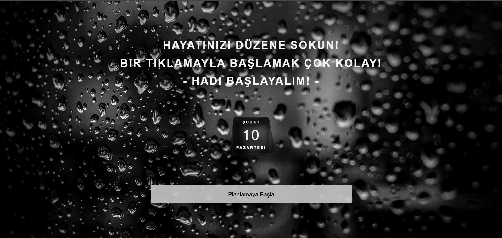
  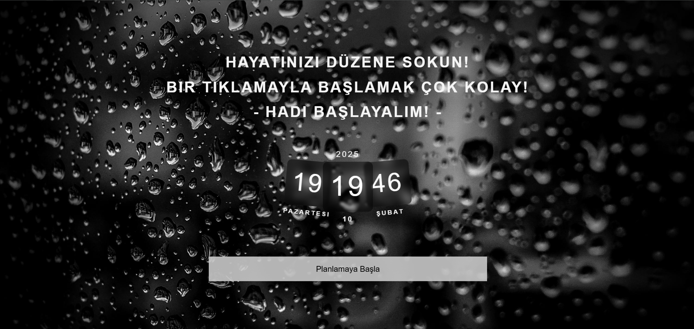
  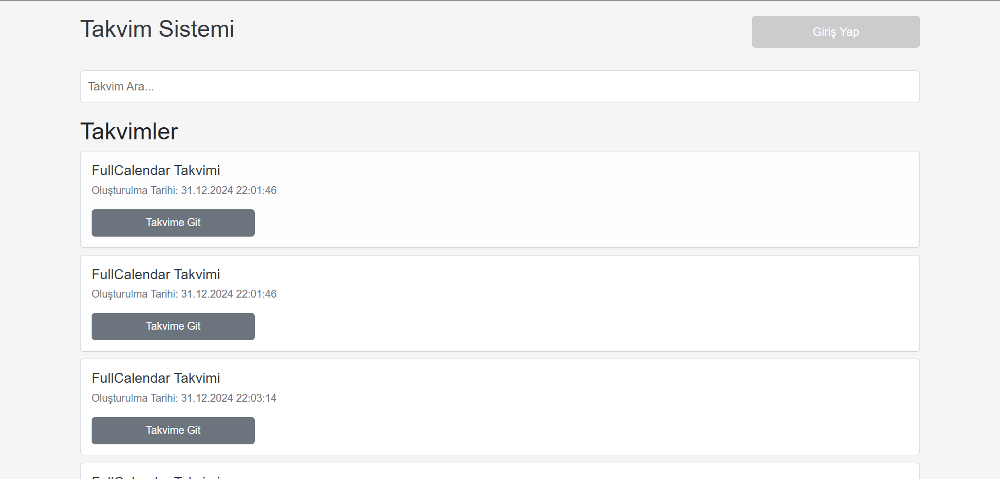
  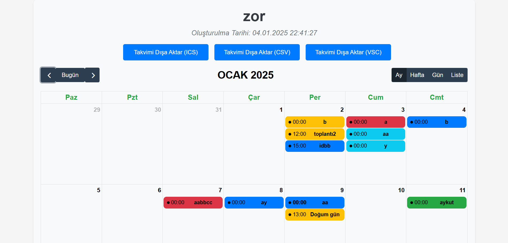
  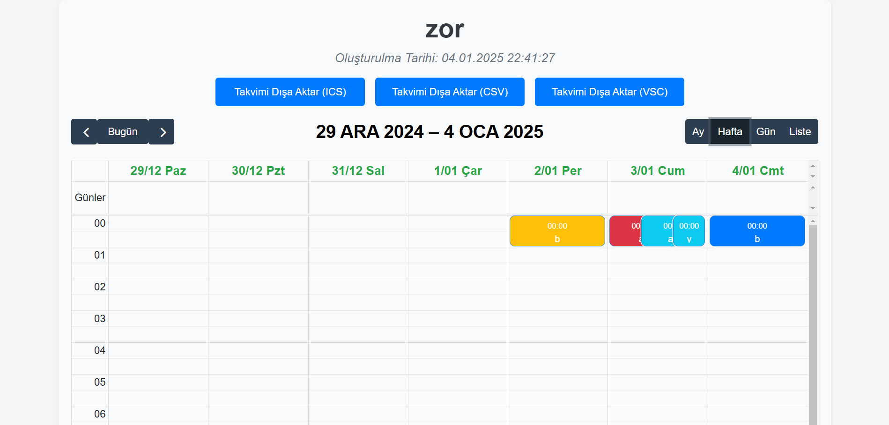
  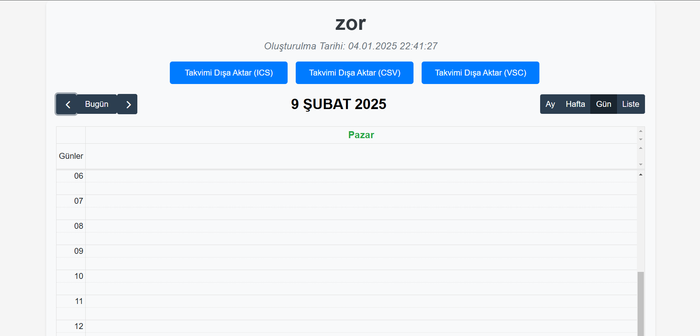
  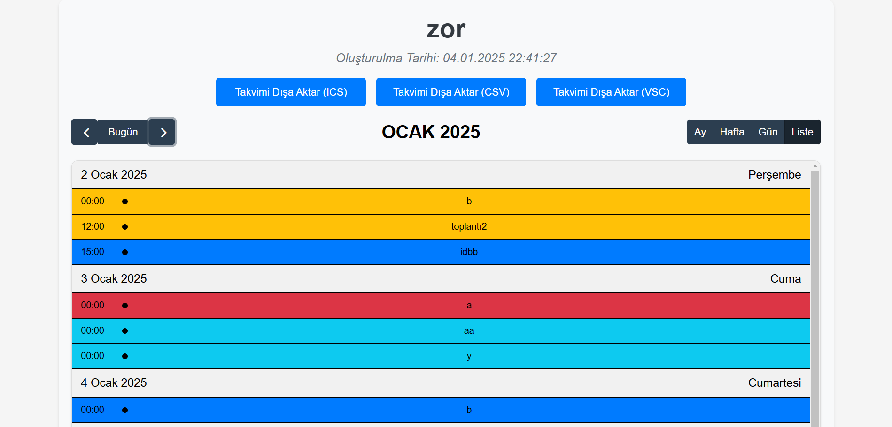
  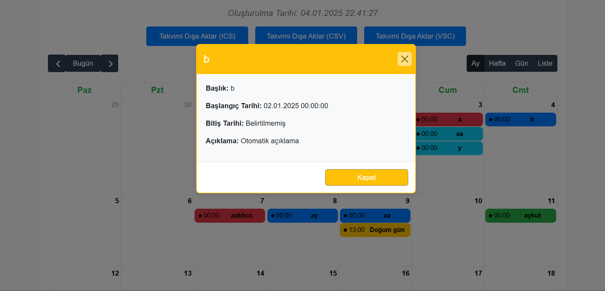
  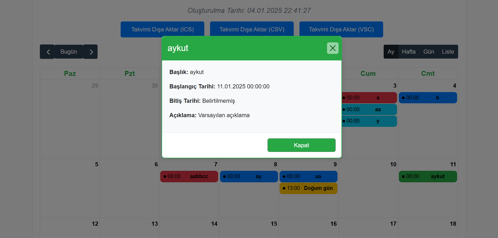
  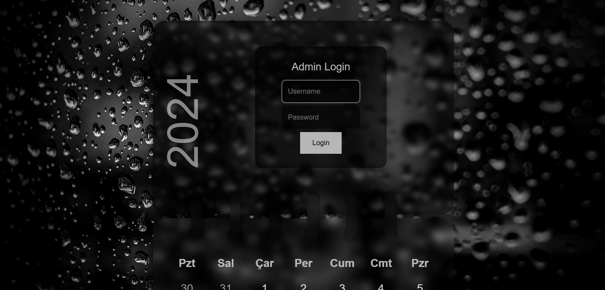
  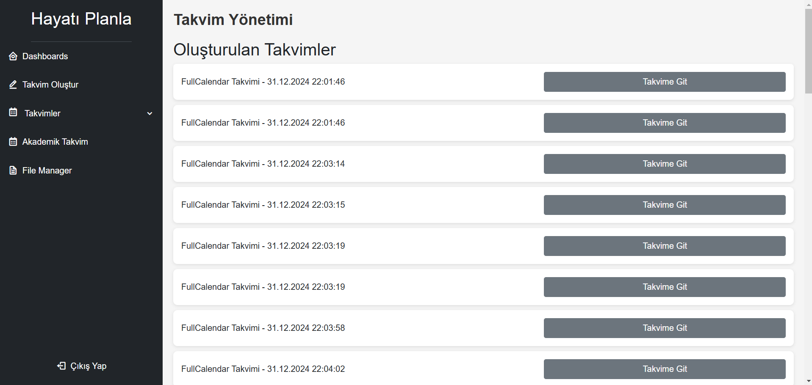
  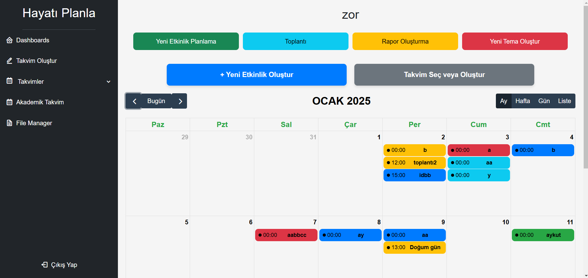
  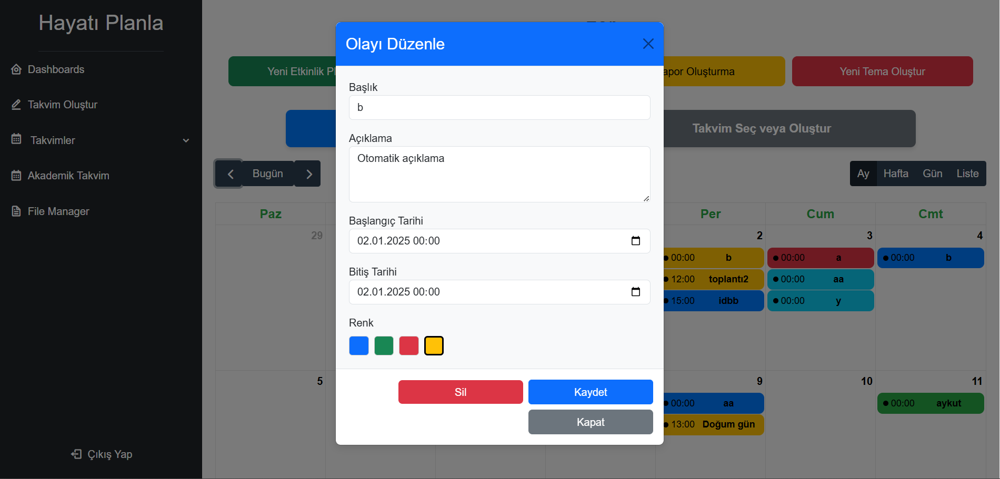
  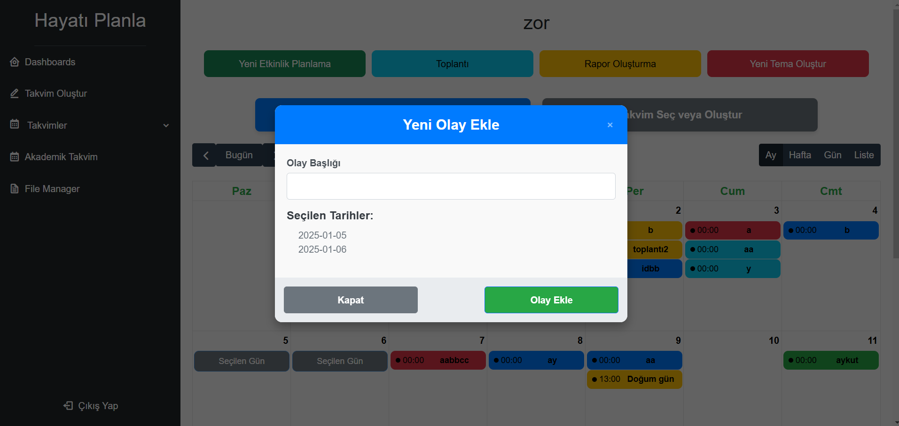
  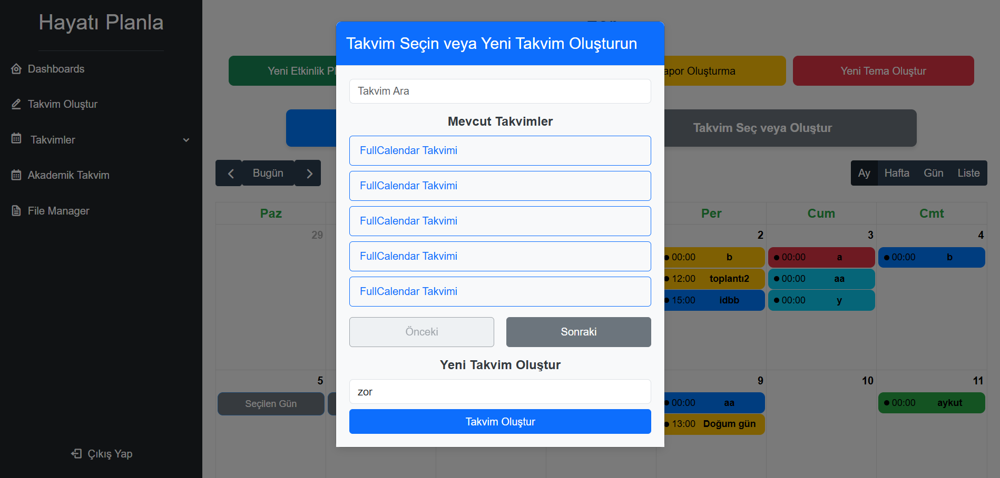
  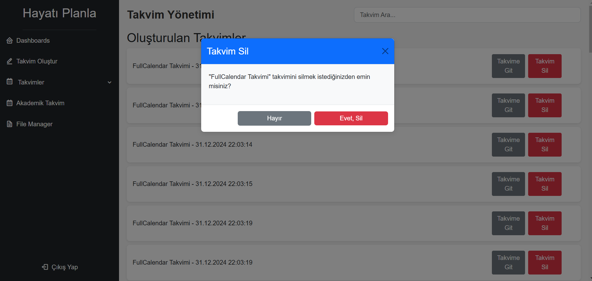
  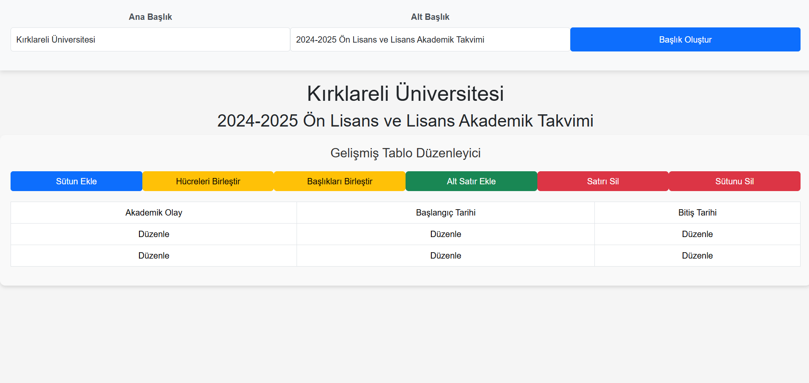
</div>
